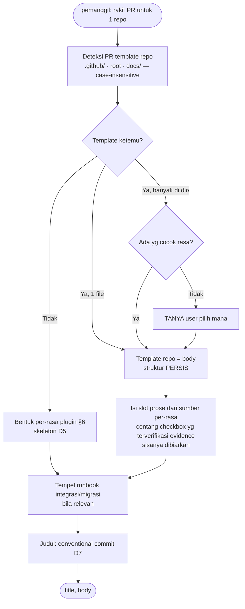
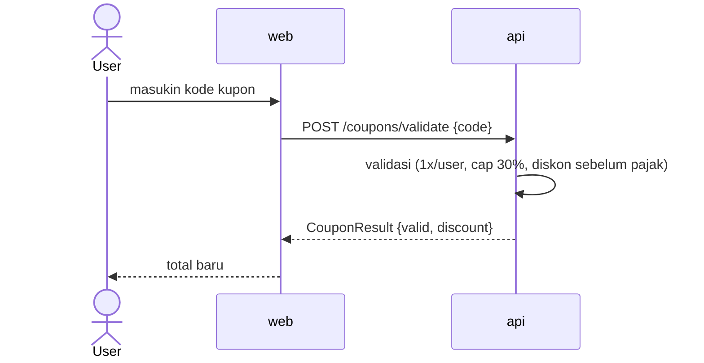

# Design — PR Template per-Rasa + Respect Template Repo

- **Tanggal:** 2026-06-28
- **Status:** Disetujui (brainstorming) → siap plan implementasi
- **Area kena:** `plugin/rules/pr-template.md` (BARU), `plugin/skills/ship/SKILL.md`, `plugin/skills/tweak/SKILL.md`, `plugin/skills/tweak/reference.md`

---

## 1. Konteks & Masalah

Saat ini PR dirakit di **dua tempat**, tanpa bentuk baku & tanpa lirik template repo:

- **`ship` step 6** bikin PR buat **feature** & **fix** (mode-fix). Instruksinya freeform: *"susun deskripsi PR dari `business.md` + `fanout.md` + `plans` + ringkasan diff"* (`ship/SKILL.md:42`). Tidak ada struktur/section baku.
- **`tweak` step 6** bikin PR sendiri (atomik, gak punya lifecycle manifest), "reuse `ship`" buat mekaniknya (`tweak/reference.md:34-38`) — tapi juga tanpa bentuk body konkret.
- **Tidak satu pun** membaca/menghormati PR template milik repo (`.github/PULL_REQUEST_TEMPLATE.md` dst). Body selalu dirakit dari `control/`, template repo diabaikan.

**Yang diminta:** (a) tiap rasa kerjaan (feature/fix/tweak) punya bentuk PR sendiri yang konsisten; (b) **kalau repo punya PR template, itu WAJIB dipakai persis** — bentuk plugin cuma fallback.

## 2. Tujuan & Non-Tujuan

**Tujuan**
- Satu sumber kebenaran untuk perakitan PR body, dipakai `ship` & `tweak` (anti-drift).
- Hormati PR template repo bila ada: template repo jadi body, struktur dipertahankan **persis**.
- Bentuk fallback per-rasa (feature/fix/tweak) yang konsisten satu skeleton.
- Integritas: jangan ngarang isi (checkbox palsu, diagram nebak).

**Non-Tujuan (YAGNI)**
- Tidak mengubah gate/quality/security `ship`. Rule ini **cuma** perakitan body + judul.
- Tidak mengubah aturan tripwire/routing `tweak`.
- Tidak menambah granularitas di luar 3 rasa (tidak per-`kind` task, tidak per-`sensitivity`). Runbook integrasi/migrasi tetap section kondisional yang sudah ada.
- Tidak bikin diagram untuk perubahan yang tidak punya alur antar-unit.

## 3. Keputusan Desain (terkunci)

| # | Keputusan |
|---|---|
| D1 | Logika perakitan PR pindah ke **satu rule share**: `plugin/rules/pr-template.md`. Dipanggil `ship` step 6 & `tweak` step 6. |
| D2 | Repo **punya** template → template repo = body, **struktur persis** (heading/urutan/checklist/komentar tak diutak-atik). |
| D3 | Repo **gak punya** template → fallback ke bentuk per-rasa plugin. |
| D4 | Saat pakai template repo, ship **mengisi** slot prose dari sumber per-rasa **dan** mencentang checkbox — **hanya yang bisa disubstansiasi**; yang tak terverifikasi dibiarkan kosong (tak pernah mengarang). |
| D5 | Skeleton fallback: `Summary → Why → Flow(kondisional) → Changes → Testing → Runbook(kondisional) → Traceability → Checklist`. |
| D6 | Heading **English**, isi **Indonesia**. |
| D7 | Judul PR ikut **conventional commits**: `feat(<unit>): …` / `fix(<unit>): …` / `tweak(<unit>): …`. |
| D8 | Section **Flow** (Mermaid **sequence diagram**) hanya muncul untuk rasa **feature** atau **fix lintas-unit** **dan** kena >1 unit yang interaksi; diturunkan dari artefak nyata, kalau tak bisa akurat → **skip**. |
| D9 | Multi-repo: deteksi template **per repo**; tiap PR ikut template repo-nya masing-masing (repo A punya template, repo B fallback → beda body). |
| D10 | Dir multi-template (`.github/PULL_REQUEST_TEMPLATE/*.md`): pilih file yang cocok rasa (by nama), tak ada yang cocok → **TANYA** user. |

## 4. Arsitektur

`pr-template.md` mengikuti pola `migration-impact.md`: **prosedur perakitan yang dipanggil**, bukan langkah berdiri sendiri. Bedanya, rule ini **menghasilkan teks** (PR title + body) untuk dipakai pemanggil di `gh pr create` — tidak menulis artifact `control/`.

```
ship/SKILL.md step 6  ─┐
                       ├──→  rules/pr-template.md  ──→  (title, body) per repo  ──→  gh pr create
tweak/SKILL.md step 6 ─┘
```

**Input dari pemanggil** (per repo unik yang kena):
- `rasa` — `feature` | `fix` | `tweak`.
- `repo_path` — toplevel repo (buat deteksi template + diff).
- **sumber konten per-rasa** (lihat §6).
- **evidence** — gate apa yang benar-benar dijalankan & lulus pemanggil (test/lint/typecheck/build, code-review, security-gate untuk ship; floor-scan + TDD + Challenge Checklist untuk tweak). Dasar pencentangan checkbox (D4).
- `units` + interaksinya (buat keputusan Flow, D8).

**Output:** `{ title, body }` siap pakai. Pemanggil yang menjalankan `gh pr create` (mekanik repo-grouping & base-branch tetap di pemanggil — tidak dipindah).

## 5. Algoritma Resolusi (per repo)



### 5.1 Deteksi template (urutan presedens, case-insensitive)
1. `.github/PULL_REQUEST_TEMPLATE.md` / `.github/pull_request_template.md`
2. `PULL_REQUEST_TEMPLATE.md` di root repo
3. `docs/PULL_REQUEST_TEMPLATE.md` / `docs/pull_request_template.md`
4. Dir `.github/PULL_REQUEST_TEMPLATE/*.md` (multi → D10)

Ketemu yang pertama menang. Tak ada → fallback (D3).

### 5.2 Mengisi template repo (D2 + D4)
- **Struktur persis**: jangan tambah/hapus/urut-ulang heading; jangan hapus checklist atau komentar `<!-- -->`. Yang diisi cuma area prose yang jelas "tempat nulis" (mis. di bawah `## Description`, mengganti `<!-- jelasin -->`).
- **Pemetaan konten** dilakukan by-understanding (LLM baca section template → cocokkan ke sumber per-rasa): `Summary/Description` ← headline; `Why/Motivation/Context` ← alasan bisnis / root_cause / rationale; `Testing/How tested` ← evidence test.
- **Konten tanpa rumah** (mis. runbook, traceability) → **append** di akhir body di bawah satu heading jelas `### Additional context (auto)`.
- **Checkbox**: centang **hanya** item yang `evidence` membuktikan (mis. "Tests pass" saat test gate lulus). Item tak terverifikasi (mis. "I tested on staging", "Updated CHANGELOG") **dibiarkan kosong**. Jangan pernah mencentang klaim yang tak bisa dibuktikan.

## 6. Bentuk Fallback per-Rasa (saat repo TAK punya template)

Skeleton (D5), heading English (D6). Section **Flow** & **Runbook** kondisional.

### 6.1 FEATURE — sumber: `business.md` + `fanout.md` + `plans/*` + diff

````markdown
## Summary
Tambah kupon diskon % di checkout — nutup cart yang ngendap (target: -15% abandonment).

## Why
business.md: user ninggalin cart di step bayar; growth kasih insentif kupon. Batas 1x/user, cap 30%.

## Flow


## Changes
- **api** — `POST /coupons/validate`, model `Coupon`, diskon dihitung sebelum pajak
- **web** — input kupon + state diskon di summary
- **package/shared** — tipe `CouponResult` dipake 2 sisi

## Testing
- test/lint/typecheck/build ijo semua app
- contract test web↔api: shape `CouponResult` cocok

## Traceability
- Feature: `control/features/kupon-checkout/` · Flow: "Checkout dengan kupon"

---
- [x] Semua test ijo
- [x] Selaras business.md (critic: no scope creep)
- [x] Security gate lewat (sensitivity: payments)
- [ ] Langkah manual env/secret dikonfirmasi
````

### 6.2 FIX — sumber: `root_cause` + diff + `relates_to`/`flow`

```markdown
## Summary
Fix: total order salah kalau kupon + pajak barengan.

## Root cause
`calcTotal()` ngurangin diskon SETELAH pajak — user kena pajak atas harga penuh. Harusnya diskon dulu → baru pajak.

## Changes
- **api** — `lib/total.ts`: urutan jadi subtotal → diskon → pajak
- **api** — test regresi `total.test.ts`

## Testing
- test regresi (tadinya merah) sekarang ijo · test/lint/build ijo

## Traceability
- Fix: `control/fixes/2026-06-28-total-kupon-pajak/`
- Relates to: feature `kupon-checkout` · flow "Checkout dengan kupon" · severity: normal

---
- [x] Bug ke-reproduce dulu (test merah)
- [x] Test regresi nutup
- [x] Selaras root_cause + invariants
```

> FIX 1-unit (contoh di atas) **tidak** punya section Flow. FIX lintas-unit (`fix.yaml.units` >1, ada `_shared.md`) **boleh** punya Flow (D8).

### 6.3 TWEAK — sumber: rationale + Challenge Checklist + diff

```markdown
## Summary
Tweak: naikin cap kupon 30% → 40% (kebijakan growth Q3).

## Rationale
Growth mau kupon lebih agresif campaign Q3. Cuma ganti konstanta kebijakan, bukan perilaku baru.

## Changes
- **api** — `config/coupon.ts`: `MAX_DISCOUNT 0.30 → 0.40` + test (40% lolos, 41% ditolak)

## Challenge Checklist
- **Bentrok aturan:** gak — masih di bawah margin aman
- **Tradeoff:** margin/order turun, konversi naik
- **Alternatif simpel:** —
- **Yang bisa jebol:** kombo kupon+promo bisa >40% total — di luar scope

## Testing
- test baru ijo · lint/build ijo · floor-scan bersih

## Capture
- `business/glossary.md`: "cap kupon = 40% (per 2026-06-28)"
```

> TWEAK atomik (tak ada manifest) → tak ada section `Traceability` bergaya feature/fix; jejaknya di `Capture`. Tak ada Flow (1-unit by definisi tripwire). `Challenge Checklist` menggantikan `Why`.

## 7. Judul PR (D7)
`<type>(<unit>): <desc ringkas>` — `type` = `feat`/`fix`/`tweak` sesuai rasa; `<unit>` = unit nyata utama yang kena (app/package); multi-unit → unit paling sentral atau hilangkan scope. Selaras gaya commit repo ini (mis. `feat(guide): …`).

## 8. Section Flow (D8) — kapan & gimana
- **Muncul bila:** rasa = `feature` ATAU `fix` lintas-unit, **DAN** >1 unit yang saling interaksi.
- **Sumber:** `flows.md` (alur bisnis) + `fanout.md` (peran app) + `_shared.md` (kontrak lintas-app) + diff. By-understanding.
- **Tipe:** Mermaid `sequenceDiagram` (aktor + pesan antar-unit).
- **Anti-fiksi:** kalau alur tak bisa diturunkan akurat dari artefak → **skip** (jangan nebak). Diagram salah lebih buruk dari tak ada.
- **Penempatan:** **hanya** di template fallback plugin. Saat template repo menang, diagram **tidak** disuntik (respect persis); paling banter mengalir ke slot prose `Description` bila alurnya kompleks — default tidak.

## 9. Perubahan ke File Eksisting

- **`plugin/rules/pr-template.md`** (BARU) — isi rule sesuai §4–§8, format mengikuti `migration-impact.md` (judul + "Dirujuk skill …" + Input/Output + Langkah + Sifat: advisory perakitan, degrade bila artefak kurang).
- **`plugin/skills/ship/SKILL.md` step 6** — ganti tiga bullet perakitan body inline (baris 42–44) jadi: *"Rakit judul + body PR ikuti `${CLAUDE_PLUGIN_ROOT}/rules/pr-template.md` (rasa = `feature` untuk fitur / `fix` untuk fix-mode; supply sumber per-rasa + evidence gate step 2/4.5). Runbook integrasi/migrasi tetap masuk sebagai section bila relevan."* Mekanik repo-grouping & `gh pr create` (baris 45) **tetap**.
- **`plugin/skills/tweak/SKILL.md` step 6** + **`tweak/reference.md §E`** — tambahkan: body PR rasa = `tweak` ikuti rule yang sama (supply rationale + Challenge Checklist + diff + evidence floor-scan/TDD). Mekanik branch/base/PR-repo yang sudah ada **tetap**.

## 10. Edge Cases
- **Repo template + repo TANPA template di fitur multi-repo** → tiap PR diputus sendiri (D9).
- **Template repo kosong / cuma komentar** → tetap dipakai persis (struktur repo), prose diisi sebisanya, sisanya `### Additional context (auto)`.
- **Dir multi-template tanpa match rasa** → TANPA tebak, TANYA (D10).
- **Diff kosong** → tetap dijaga guard `ship` step 1 / tweak (tak bikin PR) — di luar scope rule.
- **`gh`/remote tak ada** → pemanggil tampilkan body untuk dibuat manual (perilaku `ship` eksisting dipertahankan).

## 11. Skenario Acceptance (uji perilaku)

| skenario | perilaku diharapkan |
|---|---|
| repo punya `.github/PULL_REQUEST_TEMPLATE.md` | body = template repo, struktur persis, prose diisi, checkbox terverifikasi dicentang |
| repo tanpa template, feature 2-app interaksi | fallback feature + section Flow (sequence diagram) |
| repo tanpa template, feature 1-unit | fallback feature, TANPA Flow |
| repo tanpa template, fix 1-unit | fallback fix, TANPA Flow |
| repo tanpa template, fix lintas-unit | fallback fix + Flow |
| repo tanpa template, tweak | fallback tweak, TANPA Flow, TANPA Traceability manifest |
| dir `PULL_REQUEST_TEMPLATE/` ada `fix.md`+`feature.md`, rasa fix | pakai `fix.md` |
| dir multi-template tanpa match rasa | TANYA user |
| checkbox "I tested on staging" (tak terverifikasi) | dibiarkan kosong |
| fitur multi-repo: repo A punya template, repo B tidak | PR-A pakai template A; PR-B pakai fallback |
| judul PR untuk fix di unit `api` | `fix(api): <desc>` |
| alur feature tak bisa diturunkan akurat | section Flow di-skip (bukan diagram tebakan) |

## 12. Risiko & Mitigasi
- **Salah-petakan section template repo** (LLM keliru naruh konten) → mitigasi: hanya isi area prose yang jelas; konten ragu → `### Additional context (auto)` di akhir, jangan paksa ke section yang salah.
- **Checkbox palsu** → mitigasi keras D4 (centang hanya dari `evidence`).
- **Diagram nyesatin** → mitigasi D8 (skip bila tak akurat).
- **Drift dua pemakai** → mitigasi D1 (satu rule, dua pemanggil).
